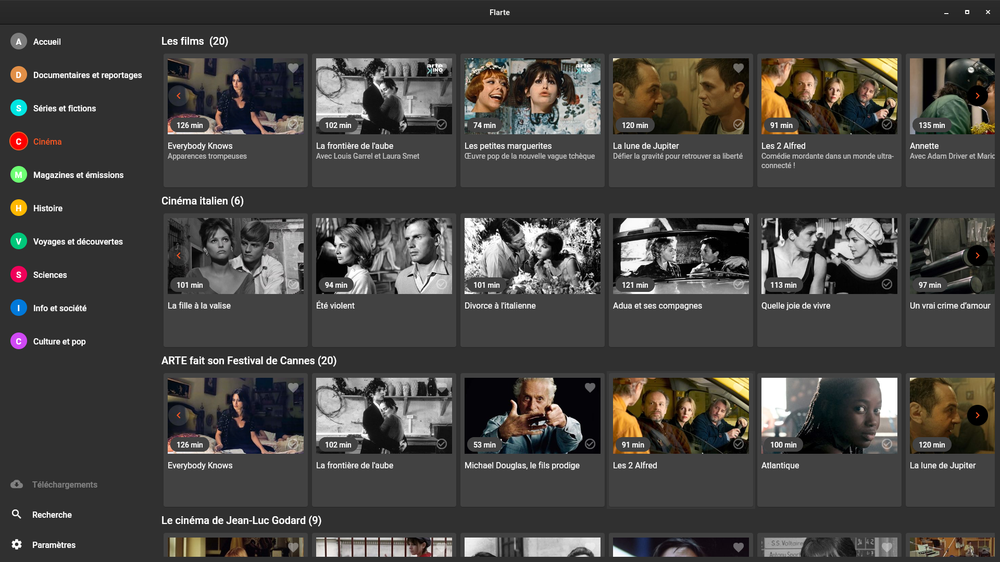

# flarte

Une application bureau *flutter* (*Linux* et *Windows*) pour naviguer sur le site https://www.arte.tv

Il copie simplement l'interface sur site, mais ajoute la possibilité de télécharger les vidéos, en utilisant *ffmpeg*.
**Toutes les vidéos sont la propriété d'arte.tv avec droits de reproduction et diffusion réservés.**

Sur Windows, s'attend à trouver le binaire ffmpeg.exe dans le répertoire flarte. Télécharge dans `%USERPROFILE%\Downloads`

Sur Linux, télécharge dans `$XDG_DOWNLOAD_DIR` si défini, et sinon dans `$HOME`

## Bientôt ?

- un gestionnaire de téléchargements ?
- des meilleurs contrôles pour le lecteur intégré
- cast to chromecast
- ajouter france.tv ?

