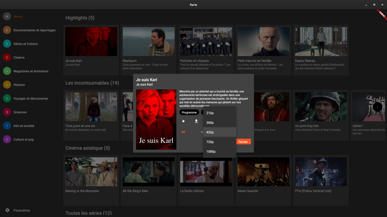

# flarte

A *flutter* desktop application (*Linux* and *Windows*) to browse https://www.arte.tv website.

It merely copies the website interface, but adds the possibility to download the videos, by using *ffmpeg*.

On Windows, excepts the binary ffmpeg.exe to be in flarte directory. Downloads to `%USERPROFILE%\Downloads` directory.

On Linux, downloads to `$XDG_DOWNLOAD_DIR` if set else to `$HOME`.

Will be configurable, once settings dialog is done.

## TODO:

- settings dialog/route
- make it usable on android tablet/phone?
- add france.tv and other network?
