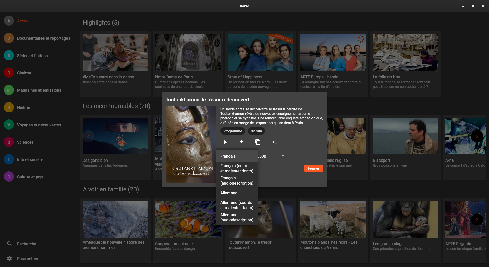

# flarte

A *flutter* desktop application (*Linux* and *Windows*) to browse https://www.arte.tv website.

It merely copies the website interface, but adds the possibility to download the videos, by using *ffmpeg*.
**It should be obvious that all the videos are copyrighted by arte.tv, and not free to share as is.**

On *Windows*, excepts the binary *ffmpeg.exe* to be in flarte directory. Downloads to `%USERPROFILE%\Downloads` directory.

On *Linux*, downloads to `$XDG_DOWNLOAD_DIR` if set else to `$HOME`.

Will be configurable, once Settings dialog is finished.

## Release archives

There are currently 2 archives with precompiled binaries:

- windows_x64.zip:  needs *ffmpeg.exe* (preferably in same directory as *flarte.exe*) to be able to download videos.
- linux_x64.tar.gz: this is built on an *Ubuntu 22.04* VM and expects *libmpv.so.1* to be present. If you have a more *recent mpv version* (with libmpv.so.2), you will have to build *flarte* yourself with `flutter build` or use another option below

There is also a *flatpak* and a *snap* available.

To be able to install the *snap* as a *local file*, you will need to use the `--dangerous` switch, otherwise you will get the error message `error: cannot find signatures with metadata for snap "flarte_x.y.z_amd64.snap"`

    sudo snap install flarte_x.y.z_amd64.snap --dangerous

To install the *flatpak*, use:

    flatpak install --user flatpak-deadbeef-x86_64.flatpak

When running, either the snap or the flatpak, you will not be able to use an external player like VLC.

## Building and running

To build and run yourself the app, once the flutter SDK is installed, you simply run `flutter run` in the directory of the source code. You will need *ninja-build*, *libgtk3-dev*, *libmpv-dev* and *mpv* installed with some other dependancies. Check flutter installation instructions. **Don't use the flutter snap**; the build will fail.

## TODO

- better control for embedded player (sound ?)
- cast to chromecast on android
- add france.tv and other network?
